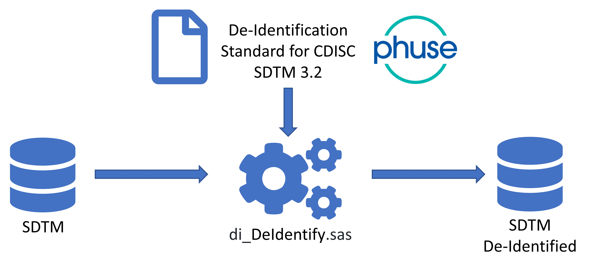

# Table of Contents

* [About The Project](#About_The_Project)
  * [Built with](#Built_With)
* [Getting Started](#Getting_Started)
  * [Prerequisites](#Prerequisites) 
  * [Installation](#Installation)
* [Usage](#Usage)
* [License](#License)
* [Contact](#Contact)
* [Acknowledgements](#Acknowledgements)

# About The Project <a name="About_The_Project"/>
This is the source code and a copy of the paper and presentation from the presentation on SDTM data de-identification I did at the Phuse conference in Barcelona 2016.

Most of the documentation and explanations you will find in the PowerPoint and PDF documents in the [Documents](./Documents) folder.

The project uses the Phuse document [PHUSE_STDM_redaction.xls](http://www.phuse.eu/Data_Transparency_download.aspx) to do de-identification of SDTM datasets according to the rules defined in the spreadsheet. These rules are considered to be identical to EMA policy 0070 on de-identification and redaction of clinical trial reports. The implementation is straight forward, as the rules are quite descriptive.

De-identification of SDTM can lead to de-identification and redaction of an entire clinical trial. If you like I build ADaM datasets entirely from SDTM, and furthermore build your Tables, Figures, and Listings (TFL) from SDTM and ADaM, you can de-identify ADaM datasets and the TFL's as well, simply by re-executing your ADaM and TFL programs on de-identified SDTM datasets. On top of this, you may have automatically generated patient profiles and patient narratives from SDTM and AdaM as well. If you re-execute those programs on de-identified data, you have effectively redacted a large part of your clinical trial text. What remains is the prose parts of the clinical trial report referring to actual data points. They too may then similarly be redacted if they are generated by some sort of program following the same principle as a simple mail-merge.

The following graphic shows a quick overview:

## Built With <a name="Built_With"/>
This project is built using SAS v9.4 and SDTM versions 3.1.2, 3.2, and 3.3. As only a limited number of general SDTM variables are in scope, it is expected to work on newer version of SDTM without modification.

# Getting Started <a name="Getting_Started"/>
## Prerequisites <a name="Prerequisites"/>
You need access to SAS and the SDTM data of your clinical trial. The macros were developed using SAS 9.4 (TS1M3) and will run on later versions. They may very well run on older versions of SAS as well.

## Installation <a name="Installation"/>
1. Obtain the spreadsheet [PHUSE_STDM_redaction.xls](http://www.phuse.eu/Data_Transparency_download.aspx) from the [Phuse](http://www.phuse.eu/Data_Transparency_download.aspx) website. You need to register to get the document. This document is used to build a local dataset containing datasets and variables to be de-identified.
2. Place the files in the [Programs](https://github.com/jmangori/CDISC-ODM-and-Define-XML-tools/blob/master/Programs) folder in your own **Programs** folder. This folder may be identical to the **Macro** folder.
3. Place the files in the [Macro](https://github.com/jmangori/CDISC-ODM-and-Define-XML-tools/blob/master/Macro) folder in your own **Macro** folder. This folder may be identical to the **Programs** folder. Else make sure this folder is in the macro search path of your SAS system.
4. Open the program `di_DeIdentify.sas` and edit the paths for the `libname` statements near the top.
   * SDTM is the libref for your original SDTM datasets as ordinary SAS datasets `(.sas7bdat)`.
   * SDTMDEID is the libref to the new SDTM datasets after de-identification as ordinary SAS datasets `(.sas7bdat)`.
5. Open the program `di_ExternalData.sas` and edit the path and possibly the file name in the `PROC IMPORT` statement pointing at the [PHUSE_STDM_redaction.xls](http://www.phuse.eu/Data_Transparency_download.aspx) spread sheet.

# Usage <a name="Usage"/>
Apart from simply running the program `di_DeIdentify.sas` which in turn executes all the macros on the default data points, a process around the de-identification needs to be in place to capture any additional data points to be de-identified. The process is described further in the [Documents](https://github.com/jmangori/CDISC-ODM-and-Define-XML-tools/blob/master/Documents) folder. The minimum steps are:
1. Revise the path names and adjust for new trials. Originally relative paths were used, and this is advisable when re-using for several trials.
2. In the program `di_DeIdentify.sas`, locate, inspect, and modify the program section labelled **Study specific extra operations** to add/remove any macro calls not representative for your trial data.
3. Run the program `di_DeIdentify.sas` and inspect the resulting reports and graphs for any unexpected issues.
4. Do a visual inspection of the de-identified SDTM datasets. This is the most important part of the process, even if it requires manually reading the entirety of the SDTM datasets several times. After all, if you haven't seen your data, how do you know what is in them?
5. If any remaining issues, loop back to 3 for adjustment of the **Study specific extra operations**

# License <a name="License"/>
Distributed under the MIT License. See [LICENSE](https://github.com/jmangori/CDISC-ODM-and-Define-XML-tools/blob/master/LICENSE) for more information.

# Contact <a name="Contact"/>
Jørgen Mangor Iversen [jmi@try2.info](mailto:jmi@try2.info)

[My web page in danish](http://www.try2.info) unrelated to this project.

[My LinkedIn profile](https://www.linkedin.com/in/jørgen-iversen-ab5908b/)

# Acknowledgements <a name="Acknowledgements"/>
This software is made public with the explicit permission from LEO Pharma A/S
